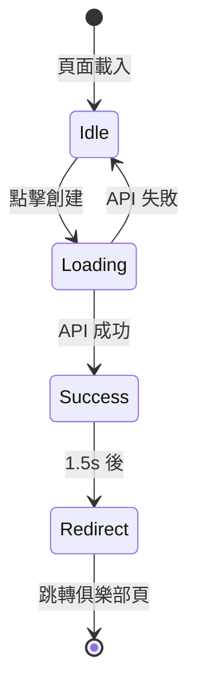

# 俱樂部創建動效設計文檔

> 創建日期：2025-12-20

---

## 概述

為俱樂部創建功能添加 Duolingo 風格的微動效，提升用戶體驗和成就感。

## 技術選型

| 功能 | 技術方案 | 說明 |
|------|----------|------|
| 禮花效果 | `canvas-confetti` | 輕量級 Canvas 動畫庫，gzip 後僅 3KB |
| 讀條動效 | CSS + React State | 無需額外依賴，使用 `setInterval` 模擬進度 |

## 實現效果

### 1. 讀條按鈕（Loading Progress）

**視覺效果**：

- 按鈕從右向左填充深灰色背景
- 顯示百分比數字 `創建中... 75%`
- 快速增長到 90%，然後等待 API 響應完成

**代碼邏輯**：

```tsx
const startProgressAnimation = () => {
    progressInterval.current = setInterval(() => {
        setProgress(prev => {
            if (prev >= 90) return prev; // 90% 暫停等待
            return prev + Math.random() * 15; // 快速遞增
        });
    }, 100);
};
```

### 2. 成功禮花（Confetti）

**視覺效果**：

- 金色和黑色粒子從畫面中央向外擴散
- 200ms 後從左右兩側再發射一波

**代碼邏輯**：

```tsx
const fireConfetti = () => {
    confetti({
        particleCount: 100,
        spread: 70,
        origin: { y: 0.6 },
        colors: ['#000000', '#333333', '#FFD700']
    });
    
    setTimeout(() => {
        confetti({ angle: 60, origin: { x: 0 } });
        confetti({ angle: 120, origin: { x: 1 } });
    }, 200);
};
```

### 3. 狀態流程



## 用戶旅程

1. **點擊「創建俱樂部」按鈕**
   - 按鈕變為讀條狀態
   - 進度快速增長到 90%

2. **等待 API 響應**
   - 進度保持在 90%
   - 按鈕禁用，防止重複點擊

3. **創建成功**
   - 進度跳到 100%
   - 按鈕變綠，顯示 ✓ 創建成功！
   - 禮花從中央和兩側發射

4. **自動跳轉**
   - 1.5 秒後跳轉到 `/club/[id]`

## 登入驗證

頁面載入時檢查登入狀態：

- 未登入：顯示提示頁面，引導用戶返回首頁
- 已登入：正常顯示表單

## 依賴安裝

```bash
npm install canvas-confetti
npm install -D @types/canvas-confetti
```

## 設計參考

- **Duolingo**：任務完成後的禮花和成功動效
- **Stripe**：支付按鈕的讀條進度
- **Linear**：創建項目後的過渡動畫
